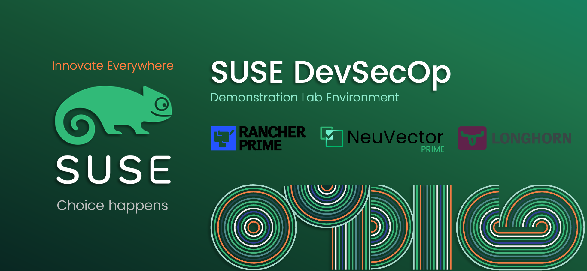

# SUSE-DevSecOps-Demo-AWS

**This GitHub repository is created to support mainly SUSE SA(s) in automatically build, deploy, install, & configure a lab environment on top of AWS cloud to be able to deliver a Demo or an Online Sessions to customers or prospects showing the features and capabilities of _SUSE_ DevSecOps solutions [_SUSE Rancher Prime_, _SUSE Longhorn_, _SUSE NeuVector Prime_]. It is also possible for any user that would like to test _SUSE_ Solution to use this GitHub repository as he/she see fit, However, _SUSE_ do not maintain this GitHub Repository and have no responsibilities for any code provided in this repository and it is highly recommended to refer to the official documentation.**

---

    

---
